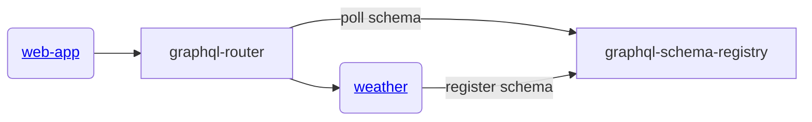

# gratheon / weather
Backend proxy service that makes request to third party weather service (open-meteo.com) and reports results in graphql format for frontend to consume.

Responsible for this view:


## Architecture




## Development
```
npm run dev
```

## Deployment
```
make deploy
```
