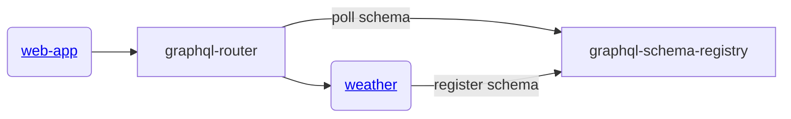

# gratheon / weather
Backend proxy service that makes request to third party weather service (open-meteo.com) and reports results in graphql format for frontend to consume.

Responsible for this view:


## Architecture




## API

### Queries

#### `weather(lat: String!, lng: String!): JSON`
Get current weather forecast from Open-Meteo API.

#### `weatherEstonia(lat: String!, lng: String!): JSON`
Get weather forecast specifically for Estonia from ilmateenistus.ee.

#### `historicalWeather(lat: String!, lng: String!, startDate: String!, endDate: String!): HistoricalWeatherData`
Get historical weather data from Open-Meteo archive API.

**Example Query:**
```graphql
query {
  historicalWeather(
    lat: "59.43",
    lng: "24.75",
    startDate: "2024-01-01",
    endDate: "2024-01-31"
  ) {
    solarRadiation {
      diffuse_radiation { time value }
      direct_radiation { time value }
    }
    wind {
      wind_speed_10m { time value }
      wind_gusts_10m { time value }
    }
    cloudCover {
      cloud_cover_low { time value }
      cloud_cover_mid { time value }
      cloud_cover_high { time value }
    }
    rain {
      rain { time value }
    }
    pollen {
      ragweed_pollen { time value }
      alder_pollen { time value }
      birch_pollen { time value }
      grass_pollen { time value }
      mugwort_pollen { time value }
      olive_pollen { time value }
    }
    pollution {
      pm2_5 { time value }
      pm10 { time value }
    }
  }
}
```

## Development
```
just start
```


## License

This project is **dual-licensed**:

- **[AGPL v3](LICENSE-AGPL.md)** - For open source use:
    - ✅ You can use, modify, and distribute the software
    - ✅ Source code is freely available
    - ⚠️ If you modify and host a public instance, you must share your modifications
    - ⚠️ Any derivative work must also be licensed under AGPL v3

- **[Commercial License](LICENSE-COMMERCIAL.md)** - For enterprise customers who need:
    - 🏢 On-premise deployment without source disclosure
    - 🔧 Custom modifications without copyleft obligations
    - 🎨 White-label/rebranding rights
    - 📞 Priority support and SLA guarantees

### Contributing

If you'd like to contribute, please see our [Contributing Guide](CONTRIBUTING.md) and sign our Contributor License Agreement (CLA).
